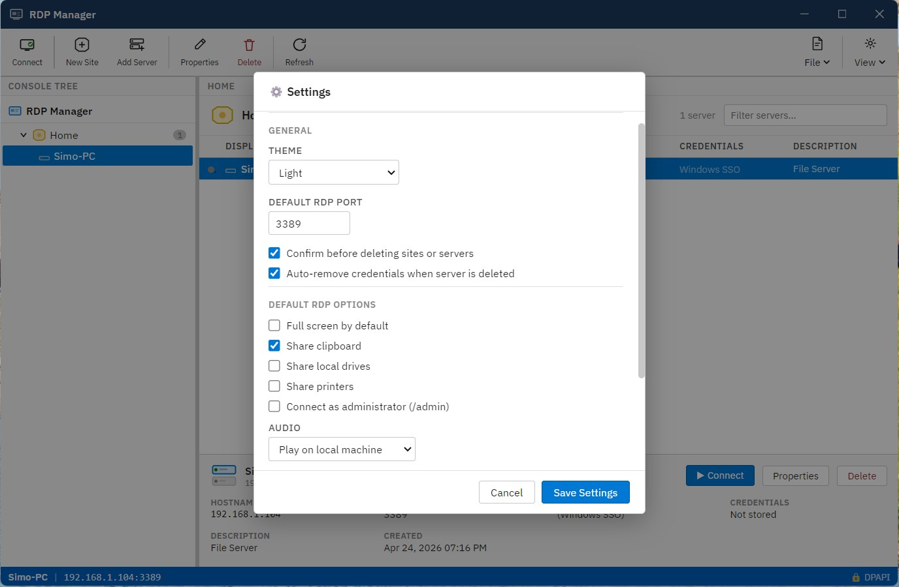

# RDP‑Manager
A lightweight, fast, and modern **Remote Desktop session manager** for Windows.  
Organize, launch, and manage RDP connections with ease.

  <a href="https://github.com/smanifold123/RDP-Manager/releases/latest"
     style="padding:12px 20px;background:#28a745;color:white;border-radius:6px;text-decoration:none;font-size:16px;">
    ⬇️ Download Latest Release
  </a>

---

## ⭐ Features

### 🔗 Connection Management
- Save unlimited RDP profiles  
- Group connections into folders  
- Quick‑launch shortcuts  
- Auto‑reconnect support  

### 🔐 Credential Handling
- Secure credential storage (DPAPI)  
- Optional credential‑less mode  
- Per‑connection overrides  

### 🖥️ UI & Usability
- Clean WPF interface  
- Resizable connection tiles  
- Search & filter  
- Status indicators  

### ⚙️ Advanced Options
- Custom screen resolutions  
- Color depth & performance tuning  
- Gateway support  
- Clipboard & device redirection toggles  

---

## 🖼️ Screenshot Gallery

### Landing Page

### New Site Creation

### Add Server – General

### Add Server – Credentials

### Add Server – Advanced

### Settings

---

## 📚 Documentation
- [Installation Guide](install.md)  
- [Feature Overview](features.md)  

---

## 🛠️ Tech Stack
- PowerShell  
- WPF + XAML  
- .NET Framework  
- MSTSC / RDP ActiveX  

---

## 📄 License
GPL‑3.0 — see the [LICENSE](../LICENSE) file.
